<div align="center">
  <h1>InterBank - Sistema de pagamentos bancários descentralizado</h1>
  <p>
    <strong>Projeto desenvolvido para a disciplina TEC502 - MI Concorrência e Conectividade</strong>
  </p>

  
  
</div>

Nos últimos anos, o cenário bancário no Brasil tem passado por uma revolução digital significativa. A criação do sistema de pagamento instantâneo Pix, por exemplo, foi um marco importante para a modernização do sistema financeiro nacional. Conforme relatado pelo Banco Central do Brasil, a adesão dos brasileiros a essas novas formas de movimentações financeiras tem sido expressiva, promovendo a inclusão financeira de diversas camadas da população que anteriormente dependiam de métodos tradicionais como boletos e cheques.

Como forma de criar uma solução descentralizada para pagamentos bancários, o InterBank foi desenvolvido. O sistema é composto por uma rede de bancos (nós) que se comunicam entre si para realizar transações financeiras de forma segura e eficiente. Assim, qualquer usuário usando qualquer um dos bancos participantes do consórcio, pode realizar transações entre suas suas contas, independente da instituição financeira de origem. Desse modo, um usuário pode criar transações com operações em diferentes bancos, de forma atômica e consistente.

Neste contexto, o método de Token Ring foi escolhido como a solução para resolver o problema de concorrência entre os bancos participantes. Este método, amplamente utilizado em redes de computadores, garante que cada banco tenha a oportunidade de acessar e atualizar as informações das contas de forma ordenada e sem conflitos, prevenindo o "duplo gasto" e assegurando a consistência dos dados. Além disso, para o desenvolvimento do projeto, foram utilizadas tecnologias como Docker, ReactJS e Go.

## Sumário
- [Sumário](#sumário)
- [Sobre o projeto](#sobre-o-projeto)
  - [Tecnologias utilizadas](#tecnologias-utilizadas)
  - [Como executar o projeto?](#como-executar-o-projeto)
- [Como utilizar?](#como-utilizar)
    - [Como definir o Banco?](#como-definir-o-banco)
    - [Como criar de uma conta](#como-criar-de-uma-conta)
    - [Como realizar um depósito](#como-realizar-um-depósito)
    - [Como visualizar o saldo de uma conta](#como-visualizar-o-saldo-de-uma-conta)
    - [Como realizar uma transferência](#como-realizar-uma-transferência)
    - [Como adicionar uma nova operação](#como-adicionar-uma-nova-operação)
    - [Como visualizar o extrato de uma conta](#como-visualizar-o-extrato-de-uma-conta)
- [Arquitetura do projeto](#arquitetura-do-projeto)
  - [Interface gráfica](#interface-gráfica)
  - [Código do banco](#código-do-banco)
- [Transações interbancárias](#transações-interbancárias)
  - [Atomicidade](#atomicidade)
  - [Assincronia](#assincronia)
  - [Consistência](#consistência)
- [Token Ring](#token-ring)
  - [Concorrência distribuída](#concorrência-distribuída)
  - [Transações simultâneas](#transações-simultâneas)
  - [Estrutura do Token Ring](#estrutura-do-token-ring)
  - [Inicialização do Token Ring](#inicialização-do-token-ring)
  - [Passagem do Token](#passagem-do-token)
  - [Detecção e recuperação de falhas](#detecção-e-recuperação-de-falhas)
- [Comunicação](#comunicação)
  - [Comunicação entre a interface e o banco](#comunicação-entre-a-interface-e-o-banco)
    - [Rotas da API](#rotas-da-api)
      - [POST /api/accounts](#post-apiaccounts)
      - [POST /api/accounts/auth](#post-apiaccountsauth)
      - [DELETE /api/accounts/:id](#delete-apiaccountsid)
      - [POST /api/payments/deposit](#post-apipaymentsdeposit)
      - [GET /api/accounts/:id](#get-apiaccountsid)
      - [GET /api/accounts/:id/all](#get-apiaccountsidall)
      - [GET /api/accounts/:id/transactions](#get-apiaccountsidtransactions)
      - [POST /api/payments/pay](#post-apipaymentspay)
  - [Comunicação entre os bancos (InterBank)](#comunicação-entre-os-bancos-interbank)
    - [Rotas do InterBank](#rotas-do-interbank)
      - [POST /interbank/prepare](#post-interbankprepare)
      - [POST /interbank/rollback](#post-interbankrollback)
      - [POST /interbank/commit](#post-interbankcommit)
      - [GET /account/:document](#get-accountdocument)
      - [POST /interbank/account/ibk/:ibk](#post-interbankaccountibkibk)
      - [PUT /interbank/token](#put-interbanktoken)
      - [GET /interbank/token](#get-interbanktoken)
      - [GET /interbank/token/ok](#get-interbanktokenok)
- [Sincronização dos dados internamente no banco](#sincronização-dos-dados-internamente-no-banco)
- [Testes](#testes)
- [Conclusão](#conclusão)

## Sobre o projeto
### Tecnologias utilizadas
- Geral
  - [Docker](https://www.docker.com/): Plataforma de código aberto para criação, execução e gerenciamento de aplicações em containers.
  - [Docker Compose](https://docs.docker.com/compose/): Ferramenta para definir e executar aplicações Docker em múltiplos containers.
- Cliente
  - [React](https://reactjs.org/): Biblioteca JavaScript para a criação de interfaces de usuário.
  - [Vite](https://vitejs.dev/): Ferramenta de build para aplicações web.
  - [TypeScript](https://www.typescriptlang.org/): Superset da linguagem JavaScript que adiciona tipagem estática ao código.
  - [TanStack Query](https://tanstack.com/query/latest): Biblioteca para gerenciamento de estado e requisições HTTP. Responsável por fazer a comunicação com o Broker.
- Bancos
  - [Go](https://golang.org/): Linguagem de programação utilizada para o desenvolvimento do Broker.
  - [Fiber](https://gofiber.io/): Framework web para Go.

### Como executar o projeto?
1. Clone o repositório localmente:
```bash
git clone https://github.com/jnaraujo/tec502-inter-bank
```

2. Acesse o diretório do projeto:
```bash
cd tec502-inter-bank
```

3. Execute o comando abaixo para iniciar o projeto:
```bash
docker-compose up --build
```

4. Acesse o endereço `http://localhost:3000` no seu navegador para acessar a interface do cliente.

## Como utilizar?
#### Como definir o Banco?
<div align="center">
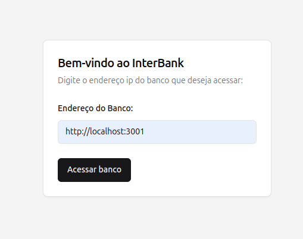 <br/>
<em>Figura 1. Definir endereço do banco</em>
</div>

Para definir o endereço do banco, escreva o endereço do banco no campo de texto e clique no botão "Acessar banco". O endereço do banco é utilizado para realizar a comunicação entre os bancos do consórcio. Após definir o endereço do banco, você será redirecionado para a página de login.

#### Como criar de uma conta
<div align="center">
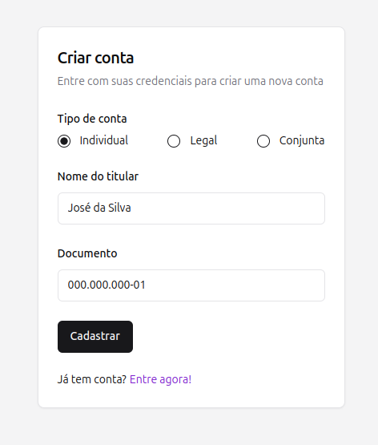 <br/>
<em>Figura 2. Criar uma nova conta</em>
</div>

Para criar uma nova conta, preencha o formulário com o nome do usuário, os documentos (CPF ou CNPJ) e o tipo da conta (pessoa física, jurídica ou conjunta) e clique no botão "Criar conta". Após criar a conta, você será redirecionado para a página do banco.

<div align="center">
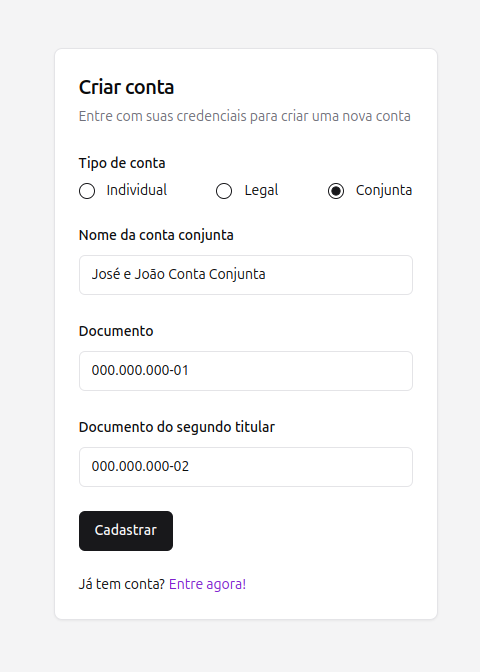 <br/>
<em>Figura 3. Criar uma nova conta conjunta</em>
</div>

Para criar uma conta conjunta, preencha o formulário com o nome da conta e os documentos dos usuários (CPF ou CNPJ) e clique no botão "Criar conta" (ambos os usuários devem ter uma conta individual previamente criada no banco). Após criar a conta, você será redirecionado para a página do banco.

#### Como realizar um depósito
<div align="center">
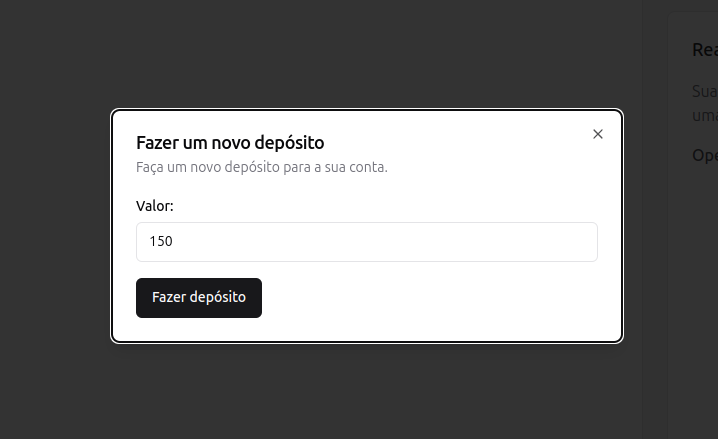 <br/>
<em>Figura 4. Criar um novo depósito</em>
</div>

Para realizar um depósito, preencha o formulário o valor a ser depositado e clique no botão "Fazer depósito". Após realizar o depósito, você verá o novo saldo da conta.

#### Como visualizar o saldo de uma conta
<div align="center">
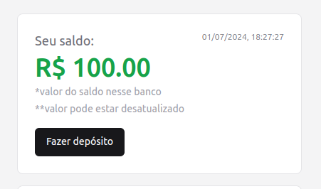 <br/>
<em>Figura 5. Visualizar saldo da conta</em>
</div>

Para visualizar o saldo de uma conta, basta verificar na caixa "Seu saldo" o valor atual da conta. O saldo é atualizado de tempos em tempos, garantindo que as informações estejam sempre atualizadas.

#### Como realizar uma transferência
<div align="center">
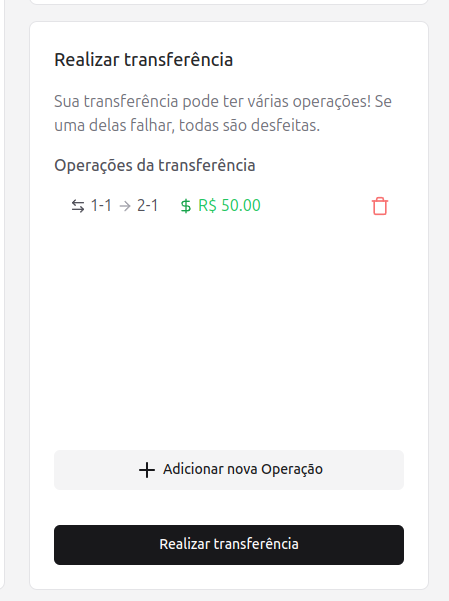 <br/>
<em>Figura 6. Criar transação</em>
</div>

Para realizar uma transferência, adicione uma nova operação clicando no botão "Adicionar nova operação". Em seguida, preencha o formulário. Após adicionar todas as operações, clique no botão "Realizar transferência".

#### Como adicionar uma nova operação
<div align="center">
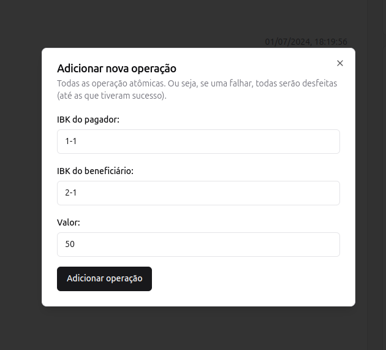 <br/>
<em>Figura 7. Adicionar nova operação</em>
</div>

Para criar uma nova operação, preencha o formulário com o IBK do pagador, o IBK do beneficiário e o valor a ser transferido e clique no botão "Adicionar operação".

#### Como visualizar o extrato de uma conta
<div align="center">
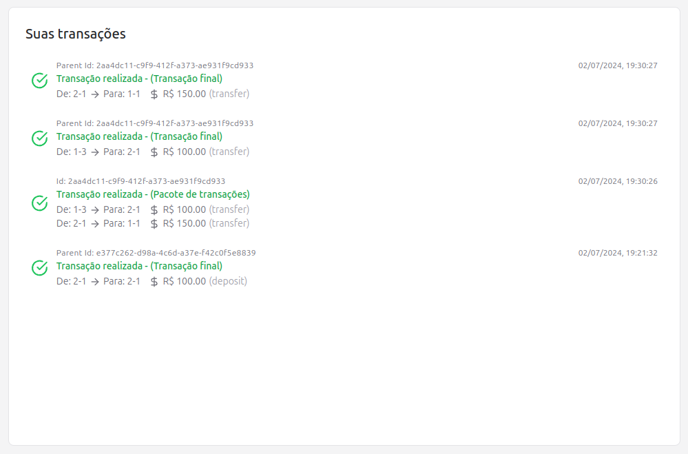 <br/>
<em>Figura 8. Visualizar extrato da conta</em>
</div>

Para visualizar o extrato de uma conta, basta verificar a lista de transações. O extrato é atualizado de tempos em tempos, garantindo que as informações estejam sempre atualizadas.

## Arquitetura do projeto
O sistema foi divido em duas partes principais: a interface gráfica do banco e o código do banco. A interface gráfica foi desenvolvida utilizando ReactJS e a biblioteca TanStack Query para gerenciamento de estado e requisições HTTP. Já o código do banco foi desenvolvido em Go, utilizando o framework Fiber.

### Interface gráfica
A interface gráfica do banco foi desenvolvida utilizando ReactJS e a biblioteca TanStack Query para gerenciamento de estado e requisições HTTP. A interface é composta por 3 páginas principais: a página de criação de conta, a página de login e a página do banco, onde é possível realizar operações como depósito, transferência, visualização de extrato e visualização de saldo.

```bash
client
├── src # Código fonte da aplicação
│   ├── @types # Alguns tipos que são utilizados em várias partes da aplicação 
│   ├── components # Componentes React reutilizáveis
│   ├── constants # Definem valores constantes, como o tempo de atualização do saldo
│   ├── contexts # Contextos são utilizados para compartilhar informações entre componentes de forma global
|   ├── stores # Stores são utilizadas para gerenciar o estado da aplicação
│   ├── hooks # Hooks são funções que permitem adicionar funcionalidades ao componente
│   ├── lib # Funções utilitárias
│   ├── routes # Definição das rotas da aplicação
│   ├── schemas # Schemas utilizados para validação de dados
│   ├── services # Funções que realizam requisições HTTP
```

### Código do banco
O código do banco foi desenvolvido em Go, utilizando o framework Fiber. Nele estão implementadas as rotas que são utilizadas para realizar as operações de criação de conta, login, depósito, transferência, visualização de extrato e visualização de saldo. Além disso, nele estão os códigos referentes ao sistema de Token Ring, que é utilizado para garantir a consistência dos dados, e o InterBank, que é responsável por garantir a comunicação entre os bancos.

```bash
broker
├── bank-api # Arquivos para teste da api
├── cmd # Comandos para execução da api e do token ring
├── internal
│   ├── config # Configurações do banco
│   ├── constants # Definições de constantes
│   ├── http # Configuração do servidor HTTP
│   ├── interbank # Definição dos padrões do InterBank
│   ├── models # Definição dos modelos de dados
│   ├── routes # Definição das rotas da aplicação
│   ├── services # Serviços utilizados para realizar as operações
│   ├── storage # Armazenamento dos dados
│   ├── token # Definição da estrutura de um Token
│   ├── transaction_processor # Serviço que roda em background para processar as transações
|   ├── validate # Funções para validação de dados
```

## Transações interbancárias
O principal objetivo do InterBank é promover a comunicação entre os bancos do consórcio, permitindo que os usuários realizem transações entre suas contas em diferentes bancos. Para isso, o InterBank é responsável por garantir que as transações sejam realizadas de forma segura e eficiente, além de garantir a consistência dos dados.

Cada transação é única, contendo um ID, o dono da transação, o tipo da transação (pacote ou final), as operações a serem realizadas, a data de criação, a data de atualização. Uma transação do tipo pacote é uma transação que contém outras transações (um pacote de transações), enquanto uma transação do tipo final é uma transação que contém a operação final a ser realizada. Cada transação criada na interface é um pacote de transação, enquanto as operações realizadas são criadas em todos as contas envolvidas como transações finais.

```go
// Código de bank/internal/models/transaction.go
type Transaction struct {
	Id         TransactionId     `json:"id"`
	Owner      interbank.IBK     `json:"owner"`
	Type       TransactionType   `json:"type"`
	Operations []Operation       `json:"operations"`
	CreatedAt  time.Time         `json:"created_at"`
	UpdatedAt  time.Time         `json:"updated_at"`
	Status     TransactionStatus `json:"status"`
}
```

As operações pertencentes a uma transação são compostas por um ID, a conta de origem, a conta de destino, o tipo da operação (débito ou crédito), o valor da operação, o status da operação, a data de criação e a data de atualização. O status da operação pode ser sucesso ou falha, indicando se a operação foi realizada com sucesso ou se ocorreu algum erro durante a operação.

```go
// Código de bank/internal/models/operation.go
type Operation struct {
	Id        uuid.UUID       `json:"id"`
	From      interbank.IBK   `json:"from"`
	To        interbank.IBK   `json:"to"`
	Type      OperationType   `json:"type"`
	Amount    decimal.Decimal `json:"amount"`
	Status    OperationStatus `json:"status"`
	CreatedAt time.Time       `json:"created_at"`
	UpdatedAt time.Time       `json:"updated_at"`
}
```

Todas as transações realizadas entre os bancos do consórcio tem como objetivo a atomicidade, assincronia e consistência. Isso significa que as transações são realizadas de forma completa e consistente, sem que ocorram falhas ou interrupções, garantindo que as transações sejam realizadas de forma ordenada e sem conflitos.

### Atomicidade
Atomicidade é uma das propriedades ACID (Atomicidade, Consistência, Isolamento e Durabilidade) que garante que as transações sejam realizadas de forma completa e consistente, sem que ocorram falhas ou interrupções. Isso significa que todas as operações presentes em uma transação devem ocorrer por completo ou nenhuma delas deve ocorrer. Desse modo, caso uma operação falhe, a transação é marcada como falha e todas as operações realizadas até o momento são revertidas.

<div align="center">
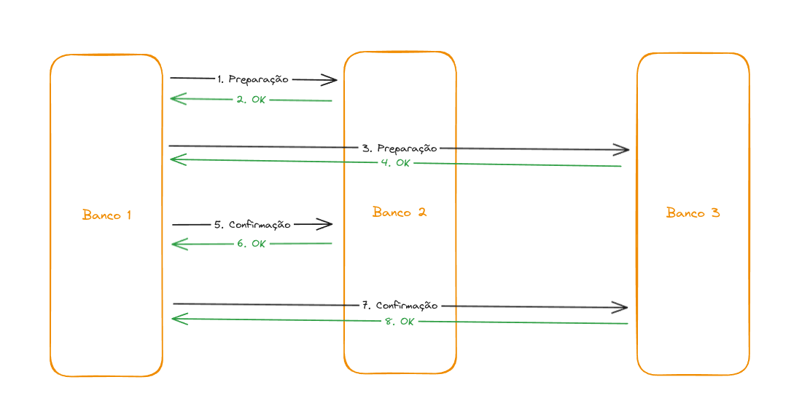 <br/>
<em>Figura 9. Operação de duas fases</em>
</div>

Para garantir a atomicidade no Interbank, foi utilizado uma variação do padrão [Two-Phase Commit](https://martinfowler.com/articles/patterns-of-distributed-systems/two-phase-commit.html). Nestes sistema, as transações são divididas em duas fases: a preparação e a confirmação. Na fase de preparação, as operações são preparadas, mas não são efetivamente realizadas. Caso todas as operações sejam preparadas com sucesso, a transação é confirmada e as operações são efetivamente realizadas.

<div align="center">
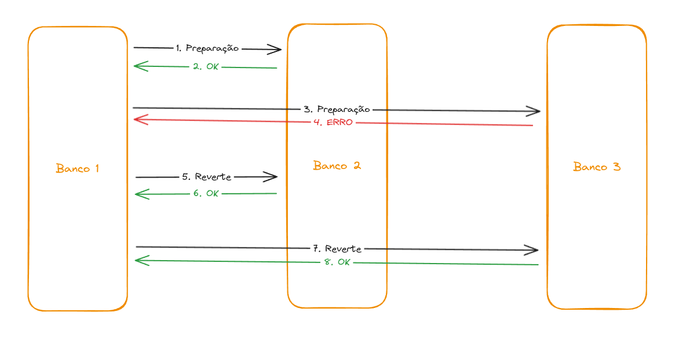 <br/>
<em>Figura 10. Operação de duas fases com falha</em>
</div>

Caso alguma falha ocorro durante a fase de preparação, a transação é marcada como falha e todas as operações preparadas até o momento são revertidas. Além disso, se algum erro ocorrer durante a confirmação das operações, a transação é marcada como falha e todas as operações realizadas até o momento são revertidas.

No código abaixo, a função `ProcessTransaction` é responsável por processar uma transação. Nela, a função `Prepare` é utilizada para preparar as operações de débito e crédito. Caso ocorra algum erro durante a preparação ou confirmação das operações, a transação é marcada como falha e as operações são revertidas. A função `Rollback` é utilizada para reverter as operações e a função `Commit` é utilizada para confirmar as operações. Além disso, as operações são marcadas como sucesso ou falha, garantindo que a transação seja realizada de forma completa e consistente.

```go
// Código de bank/internal/services/inter_bank.go
func ProcessTransaction(tr models.Transaction) error {
	externalTransactions := []txProcess{} // transações externas que foram realizadas
	isSuccess := true
	for _, op := range tr.Operations {
		txDebit := Prepare(op, StepDebit) // prepara a operação de débito
		if txDebit == nil { // se ocorrer algum erro, a transação é marcada como falha
			isSuccess = false
			break
		}
		externalTransactions = append(externalTransactions, txProcess{Tx: txDebit, Step: StepDebit})

		txCredit := Prepare(op, StepCredit) // prepara a operação de crédito
		if txCredit == nil { // se ocorrer algum erro, a transação é marcada como falha
			isSuccess = false
			break
		}
		externalTransactions = append(externalTransactions, txProcess{Tx: txCredit, Step: StepCredit})
	}

	if !isSuccess { // se ocorreu algum erro, as transações ja feitas devem sofrer rollback
		for _, tx := range externalTransactions { // as transações são revertidas
			Rollback(tx.Tx.Id, tx.Tx.Operations[0], tx.Step)
		}
		for _, op := range tr.Operations { // as operações da transação são marcadas como falha
			storage.Transactions.UpdateOperationStatus(tr, op, models.OperationStatusFailed)
		}
		storage.Transactions.UpdateTransactionStatus(tr, models.TransactionStatusFailed) // a transação é marcada como falha
		return errors.New("transaction failed")
	}

	for _, tx := range externalTransactions { // se todas as operações foram preparadas
		ok := Commit(tx.Tx.Id, tx.Tx.Operations[0], tx.Step) // as operações são confirmadas
		if !ok {
			isSuccess = false // se ocorrer algum erro, a transação é marcada como falha
			break
		}
	}

	if !isSuccess { // se ocorreu algum erro, as transações ja feitas devem sofrer rollback
	 // ...
	}

	for _, op := range tr.Operations { // as operações da transação são marcadas como sucesso
		storage.Transactions.UpdateOperationStatus(tr, op, models.OperationStatusSuccess)
	}
	storage.Transactions.UpdateTransactionStatus(tr, models.TransactionStatusSuccess) // a transação é marcada como sucesso
	return nil
}
```

### Assincronia
As transações no InterBank são realizadas de forma assíncrona. Isso significa que as transações são criadas e processadas em background, sem que o usuário precise esperar pela conclusão da transação. Desse modo, o usuário pode realizar outras operações enquanto a transação é processada, garantindo que o sistema seja eficiente e responsivo.

Quando uma transação é criada em um banco, ela é adicionada na [fila interna](bank/internal/storage/transaction_queue.go) do banco. Essa fila é processada em background por um [serviço](bank/internal/transaction_processor/processor.go) que é responsável por processar as transações de forma assíncrona. O serviço verifica de tempos em tempos se o banco tem a posse do [token](#token-ring) e, caso tenha, processa a transação. Caso contrário, a transação é mantida na fila até que o banco possua o token. Desse modo, nenhuma transação é realizada até que o banco possua o token. Isso garante que as transações sejam realizadas de forma ordenada e sem conflitos.

Assim que o token é adquirido, o banco começa o processamento das transações, uma de cada vez e na ordem em que foram adicionadas na file. Como cada transações possui N operações, o banco processa cada operação de forma atômica. Assim, caso uma operação falhe, a transação é marcada como falha e nenhuma operação é realizada.

Todas as operações realizada no processamento das operações (como verificar se o usuário existe, adicionar fundos na conta, subtrair fundos da conta, etc) são realizados através do InterBank.

### Consistência
A consistência é uma das propriedades ACID (Atomicidade, Consistência, Isolamento e Durabilidade) que garante que as transações sejam realizadas de forma ordenada e sem conflitos. No Interbank, a consistência é garantida através do uso do [Token Ring](#token-ring), que é responsável por garantir que as transações sejam realizadas de forma ordenada e sem conflitos. Além disso, o InterBank é responsável por garantir que as transações sejam realizadas de forma consistente, ou seja, que as operações sejam realizadas de forma completa e correta.

Todas as transações criadas no mesmo banco são processadas de forma ordenada e sem conflitos. Isso significa que, caso duas transações sejam criadas no mesmo banco, a primeira transação é processada antes da segunda transação. Além disso, todas as operações presentes em uma transação são realizadas de forma completa e correta, garantindo que as transações sejam realizadas de forma consistente. O InterBank, porém, não garante que a ordem das transações seja a mesma em todos os bancos, podendo uma transação criada em P+1 no banco 2 ser processada antes de uma transação criada em P no banco 1. Ainda assim, a consistência é garantida, pois todas as operações são realizadas de forma completa e correta.

## Token Ring
O Token Ring é um protocolo que utiliza um token para controlar o acesso a uma rede de computadores. O token é passado de nó em nó, garantindo que cada nó tenha a oportunidade de acessar a rede e realizar operações de forma ordenada e sem conflitos. O algoritmo de Token Ring é baseado em uma topologia em anel e amplamente utilizado em redes e computadores, sendo originalmente definido pelo padrão IEEE 802.5.

<div align="center">
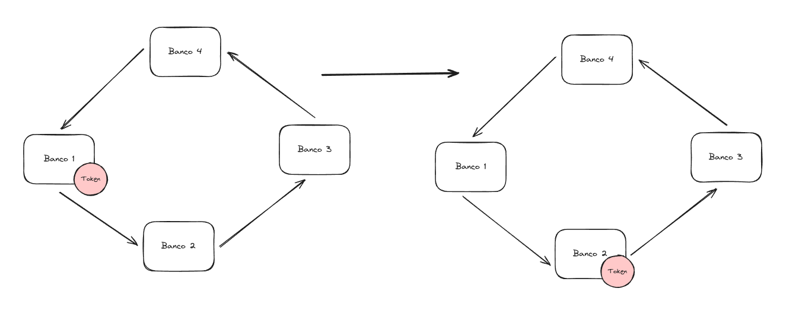 <br/>
<em>Figura 9. Token Ring</em>
</div>

No contexto do InterBank, o Token Ring é utilizado para garantir que cada banco tenha a oportunidade de acessar e atualizar as informações das contas de forma ordenada e sem conflitos. O token é passado de banco em banco, seguindo a ordem dos IDs dos bancos. Quando um banco possui o token, ele pode realizar operações de leitura e escrita nos dados armazenados. Caso um banco deseje realizar uma operação e não possua o token, ele deve esperar até que o token seja passado para ele.

### Concorrência distribuída
O uso do Token Ring garante que apenas um banco terá acesso a rede por vez, impedindo que ocorram conflitos entre os bancos. Assim, mesmo com diferentes transações sendo criadas na rede ao mesmo tempo, apenas um banco poderá processar as suas transações locais por vez. Além disso, como cada banco possui sua fila local e processa apenas uma transação por vez, é garantido que as transações sejam realizadas de forma ordenada e sem conflitos.

Desse modo, as operações são realizada uma de cada vez e na ordem em que foram adicionadas na fila, garantindo que o saldo final da conta seja consistente e sem duplicação de dados. Além disso, devido a natureza atômica das transações, até as transações que falharam são processadas de forma consistente.

### Transações simultâneas
Garantir que diferentes usuários possam realizar transações simultâneas é um dos principais desafios de um sistema distribuído. Com o método de Token Ring, é possível garantir que as transações sejam realizadas de forma ordenada e sem conflitos, mesmo que diferentes usuários estejam realizando transações ao mesmo tempo.

Caso um banco deseje realizar uma operação e não possua o token, ele deve esperar até que o token seja passado para ele. Para garantir que as operações sejam realizadas de forma ordenada e sem conflitos, foi implementado um mecanismo de fila de transações. Assim que uma transação é criada, ela é adicionada na fila de transações do banco. Quando o banco possui o token, ele processa as transações da fila, uma de cada vez e na ordem em que foram adicionadas. Isso garante que as transações sejam realizadas de forma ordenada e sem conflitos.

Desse modo, mesmo que diferentes transações que afetem o mesmo usuário sejam criadas no mesmo banco (ou em outros bancos), elas são processadas de forma ordenada e sem conflitos. Isso garante que as transações sejam realizadas de forma consistente e sem duplicação de dados.

### Estrutura do Token Ring
O [Token Ring](bank/internal/storage/ring.go) é composto por um conjunto de bancos (nós) que se comunicam entre si para realizar transações financeiras de forma segura e eficiente. Cada banco possui um ID único, que é utilizado para determinar a ordem em que os bancos acessam e atualizam as informações das contas. O token é passado de banco em banco, seguindo a ordem dos IDs dos bancos.

Todos os bancos do consórcio são definidos com antecedência e cada banco possui um ID único. O ID é utilizado para determinar a ordem em que os bancos acessam e atualizam as informações das contas. O token é passado de banco em banco, seguindo a ordem dos IDs dos bancos.

```go
// Código de bank/internal/storage/ring.go
type ringData struct {
   Id   interbank.BankId
   Addr string
}

// implementação de um token ring para
// comunicação entre os bancos
type ringStorage struct {
   mu   sync.RWMutex
   ring []ringData
}
```

### Inicialização do Token Ring
Quando o sistema é iniciado, o banco com ID mais baixo é o responsável por criar o token e passá-lo para o próximo banco. O token é passado de banco em banco, seguindo a ordem dos IDs dos bancos. Quando o token chega no último banco, ele é passado de volta para o primeiro banco, fechando o anel. Esse processo é repetido indefinidamente, garantindo que cada banco tenha a oportunidade de acessar e atualizar as informações das contas de forma ordenada e sem conflitos. O código a seguir demonstra como o token é passado de banco em banco.

```go
// código de bank/internal/services/token_ring.go
// Se o banco atual é o banco com menor ID
if storage.Ring.FindBankWithLowestId().Id == config.Env.BankId {
// verifica se o token já esta na rede.
if !services.IsTokenOnRing() {
   // se não estiver, cria o token
   services.BroadcastToken(config.Env.BankId)
}
}
```

### Passagem do Token
Quando um banco possui o token, ele pode realizar operações de leitura e escrita nos dados armazenados. Caso um banco deseje realizar uma operação e não possua o token, ele deve esperar até que o token seja passado para ele. Assim que o banco termina de processar as transações, ele passa o token para o próximo banco. Caso o próximo banco não esteja disponível, ele tentará enviar para o próximo banco, e assim por diante. Caso nenhum banco esteja disponível, o token é mantido no banco atual.

O código abaixo demonstra como a passagem do token é realizada. O banco verifica se o próximo banco está disponível e, caso esteja, ele passa o token para ele. Caso contrário, ele tenta passar para o próximo banco, e assim por diante. Caso nenhum banco esteja disponível, o token é mantido no banco atual.
```go
// código de bank/internal/transaction_processor/processor.go
// Verifica se o banco possui o token (localmente)
if storage.Token.HasToken() {
   // Em seguida, ele pergunta a rede quem é o dono do token
   // É feita essa segunda verificação para garantir que o token não foi perdido
   bank := services.AskBankWithToken()
   if bank != nil && bank.Owner != storage.Token.Get().Owner {
      // Se o banco atual não for o real dono do Token, ele atualiza o token internamente
      storage.Token.Set(*bank)
      continue
   }

   // se o banco atual for o dono do token, ele processa as transações localmente
   processLocalTransactions()
   // em seguida, ele passa o token para o próximo banco
   services.PassToken()
}
```

### Detecção e recuperação de falhas
Um dos principais problemas da utilização do método de Token Ring é a possibilidade de falhas. Caso um banco que possua o token caia, o token é perdido e as transações não podem ser realizadas. Para resolver esse problema, foi implementado um mecanismo de detecção e recuperação de falhas.

<div align="center">
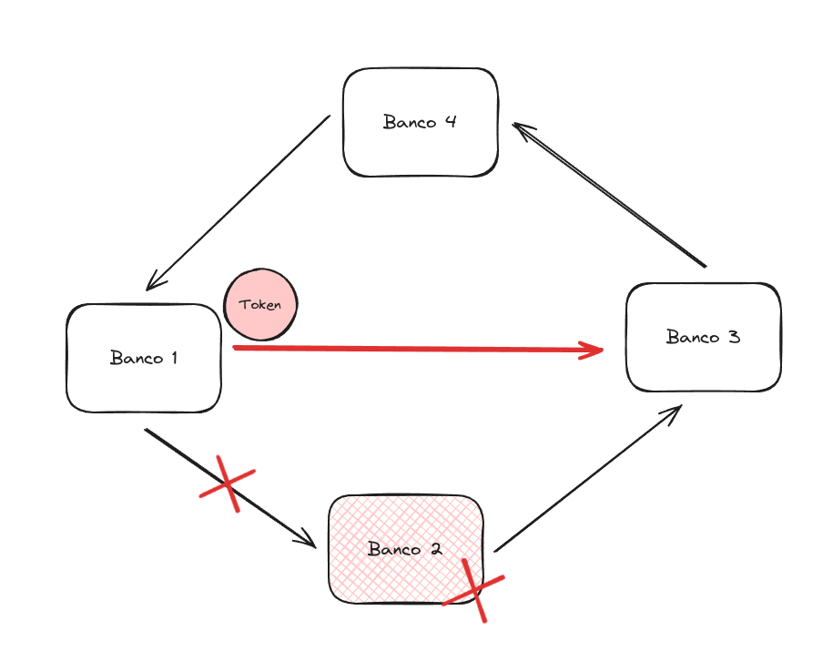 <br/>
<em>Figura 10. Detecção e recuperação de falhas</em>
</div>

Por exemplo, quando o banco que detém termina de processar as transações, ele passa o token para o próximo banco. Caso o próximo banco não esteja disponível, ele tentará enviar para o próximo banco, e assim por diante. Caso nenhum banco esteja disponível, o token é mantido no banco atual.

Para garantir que não ocorra duplicação de tokens, antes de iniciar o processamento das transações, o banco envia um multicast para todos os bancos do consórcio, perguntando quem é o dono do token. Caso o banco seja o dono do token, ele inicia o processamento das transações. Caso contrário, ele atualiza as informações internas sobre quem é o dono do token.

Além disso, foi implementado um mecanismo de timeout para garantir que o token seja passado de banco em banco. Caso o banco que detém o token não passe o token para o próximo banco em um determinado tempo, o token é considerado perdido e o próximo banco assume a responsabilidade de criar um novo token e avisar a todos que ele é agora o novo detentor do token. Para isso, o próximo banco utiliza o horário de criação do token (estrutura `Ts` do [Token](#estrutura-do-token)) como referência para verificar se o token foi perdido. Caso a diferença entre o horário atual e o horário de criação do token seja maior que um determinado tempo, o token é considerado perdido e o próximo banco assume a responsabilidade de criar um novo token.

Caso o próximo banco também está indisponível, o banco anterior ao último banco que possuía o token assume a responsabilidade de criar um novo token e passar para o próximo banco. Isso garante que o token seja passado de banco em banco e que as transações sejam realizadas de forma ordenada e sem conflitos.

## Comunicação
Como forma de padronizar a comunicação tanto entre a interface e o banco, quanto entre os bancos do consórcio, foi utilizado o padrão de API REST. O uso de APIs REST permite que as operações sejam realizadas de forma simples e eficiente, além de garantir a interoperabilidade entre diferentes sistemas.

### Comunicação entre a interface e o banco
Como forma de padronizar a comunicação entre a interface e o banco, foi definido um conjunto de rotas que são utilizadas para realizar as operações de criação de conta, login, depósito, transferência, visualização de extrato e visualização de saldo. Para realizar essas operações, a interface faz requisições HTTP para o banco, que por sua vez processa a requisição e retorna uma resposta. Essas requisições seguem o padrão REST, onde cada operação é realizada através de um método HTTP específico.

#### Rotas da API
##### POST /api/accounts
Esta [rota](/bank/internal/routes/bank/create-account.go) é utilizada para criar uma nova conta no banco. Ela recebe um objeto JSON contendo o nome do usuário (ou razão social), os documentos (CPF ou CNPJ, podendo ser mais de um em caso de conta conjunta) e o tipo da conta (pessoa física, jurídica ou conjunta). O banco então cria a conta e retorna um objeto JSON contendo os dados da conta criada.

Exemplo de requisição para criar uma conta individual:
```http
POST /api/accounts

{
  "name": "João da Silva",
  "documents": ["000.000.000-01"],
  "type": "individual"
}
```

Exemplo de resposta:
```http
201 Created

{
  "id": 1,
  "name": "José da Silva",
  "documents": [
    "000.000.000-01"
  ],
  "type": "individual",
  "ibk": "1-1",
  "created_at": "2024-06-28T19:54:46.16347775-03:00",
  "balance": "0"
}
```

Exemplo de requisição para criar uma conta conjunta:
```http
POST /api/accounts

{
  "name": "João e Maria da Silva",
  "documents": ["000.000.000-01", "000.000.000-01"],
  "type": "joint"
}
```

##### POST /api/accounts/auth
A [rota](/bank/internal/routes/bank/auth.go) de autenticação é utilizada para realizar o login de um usuário. Ela recebe um objeto JSON contendo o InterBank Key (IBK) do usuário. O banco então verifica se o IBK é válido e retorna um objeto JSON contendo os dados da conta.

Exemplo de requisição:
```http
POST /api/accounts/auth

{
  "ibk": "1-1"
}
```

Exemplo de resposta:
```http
200 OK

{
  "id": 1,
  "name": "José da Silva",
  "documents": [
    "000.000.000-01"
  ],
  "type": "individual",
  "ibk": "1-1",
  "created_at": "2024-06-28T19:54:46.16347775-03:00",
  "balance": "0"
}
```

Exemplo de resposta para IBK inválido:
```http
401 Unauthorized

{
  "message": "Conta não encontrada"
}
```

##### DELETE /api/accounts/:id
Esta [rota](/bank/internal/routes/bank/delete-account.go) é utilizada para deletar uma conta no banco. Ela recebe o ID da conta a ser deletada e o banco então deleta a conta e retorna um objeto JSON contendo os dados da conta deletada.

Exemplo de requisição:
```http
DELETE /api/accounts/1
```

Exemplo de resposta:
```http
200 OK

{
  "message": "Conta deletada com sucesso"
}
```

##### POST /api/payments/deposit
Esta [rota](/bank/internal/routes/bank/deposit-route.go) é utilizada para realizar um depósito em uma conta. Ela recebe um objeto JSON contendo o IBK da conta e o valor a ser depositado. O banco então realiza o depósito e retorna um objeto JSON contendo os dados da transação. Como o deposito é uma operação atômica, a transação é realizada de forma instantânea, não dependendo do InterBank para ser concluída.

Exemplo de requisição:
```http
POST /api/payments/deposit

{
  "acc_ibk": "1-1",
  "amount": "100"
}
```

Exemplo de resposta:
```http
200 OK

{
  "id": "f64417e9-683c-4de8-a74b-31133002a808",
  "owner": "1-1",
  "type": "final",
  "operations": [
    {
      "id": "69600a35-2083-43ac-ba5d-a8a62467eab1",
      "from": "1-1",
      "to": "1-1",
      "type": "deposit",
      "amount": "100",
      "status": "success",
      "created_at": "2024-06-28T20:03:24.38772134-03:00",
      "updated_at": "2024-06-28T20:03:24.387726119-03:00"
    }
  ],
  "created_at": "2024-06-28T20:03:24.387722803-03:00",
  "updated_at": "2024-06-28T20:03:24.387726249-03:00",
  "status": "success"
}
```

##### GET /api/accounts/:id
Esta [rota](/bank/internal/routes/bank/find-account.go) é utilizada para visualizar os dados de uma conta. Ela recebe o ID da conta e o banco então retorna um objeto JSON contendo os dados da conta.

Exemplo de requisição:
```http
GET /api/accounts/1
```

Exemplo de resposta:
```http
200 OK

{
  "id": 1,
  "name": "José da Silva",
  "documents": [
  "000.000.000-01"
  ],
  "type": "individual",
  "ibk": "1-1",
  "created_at": "2024-06-28T20:03:19.09762633-03:00",
  "balance": "100"
}
```

##### GET /api/accounts/:id/all
Esta [rota](/bank/internal/routes/bank/find-all-accounts.go) é responsável por retornar todas as contas do usuário (tanto as contas no banco atual, quanto as contas em outros bancos). Ela recebe o ID da conta e o banco é responsável por enviar um multicast para todos os bancos do consórcio, solicitando as contas do usuário. Cada banco então retorna um objeto JSON contendo os dados da conta.

Exemplo de requisição:
```http
GET /api/accounts/1/all
```

Exemplo de resposta:
```http
200 OK

[
  {
    "id": 1,
    "name": "José da Silva",
    "documents": [
      "000.000.000-01"
    ],
    "type": "individual",
    "ibk": "1-1",
    "created_at": "2024-06-28T20:03:19.09762633-03:00",
    "balance": "100"
  },
  {
    "id": 1,
    "name": "José da Silva",
    "documents": [
      "000.000.000-01"
    ],
    "type": "individual",
    "ibk": "2-1",
    "created_at": "2024-06-28T20:08:00.643185361-03:00",
    "balance": "0"
  }
]
```

##### GET /api/accounts/:id/transactions
Esta [rota](/bank/internal/routes/bank/list-account-transactions.go) é utilizada para visualizar as transações de uma conta. Ela recebe o ID da conta e retorna um objeto JSON contendo as transações realizadas pela conta.

Exemplo de requisição:
```http
GET /api/accounts/1/transactions
```

Exemplo de resposta:
```http
200 OK

[
  {
    "id": "5f86cc57-a57b-4bcc-b707-3df28eaa679c",
    "owner": "1-1",
    "type": "package",
    "operations": [
      {
        "id": "153e7f58-0764-4767-bde6-cd5ac00ae73b",
        "from": "1-1",
        "to": "2-1",
        "type": "transfer",
        "amount": "50",
        "status": "failed",
        "created_at": "2024-06-28T20:08:52.768665384-03:00",
        "updated_at": "2024-06-28T20:08:53.043557766-03:00"
      },
      {
        "id": "ad5e4166-734a-4669-87b3-337c09def0e6",
        "from": "2-1",
        "to": "2-2",
        "type": "transfer",
        "amount": "100",
        "status": "failed",
        "created_at": "2024-06-28T20:08:52.7687795-03:00",
        "updated_at": "2024-06-28T20:08:53.043558096-03:00"
      }
    ],
    "created_at": "2024-06-28T20:08:52.768782115-03:00",
    "updated_at": "2024-06-28T20:08:53.043558226-03:00",
    "status": "failed"
  },
  {
    "id": "f64417e9-683c-4de8-a74b-31133002a808",
    "owner": "1-1",
    "type": "final",
    "operations": [
      {
        "id": "69600a35-2083-43ac-ba5d-a8a62467eab1",
        "from": "1-1",
        "to": "1-1",
        "type": "deposit",
        "amount": "100",
        "status": "success",
        "created_at": "2024-06-28T20:03:24.38772134-03:00",
        "updated_at": "2024-06-28T20:03:24.387726119-03:00"
      }
    ],
    "created_at": "2024-06-28T20:03:24.387722803-03:00",
    "updated_at": "2024-06-28T20:03:24.387726249-03:00",
    "status": "success"
  }
]
```

##### POST /api/payments/pay
Esta [rota](/bank/internal/routes/bank/pay-route.go) é utilizada para realizar uma transferência entre contas. Ela recebe um objeto JSON contendo o IBK do autor da transação e uma lista de operações, onde cada operação contém o IBK da conta de origem, o IBK da conta de destino e o valor a ser transferido. O banco então realiza a transferência e retorna um objeto JSON com os detalhes da transação. Como a transferência depende do InterBank, a transação é criada de forma assíncrona e processada em background.

Exemplo de requisição:
```http
POST /api/payments/pay

{
  "author": "1-1",
  "operations": [
    {
      "from": "1-1",
      "to": "2-1",
      "amount": 50
    },
    {
      "from": "2-1",
      "to": "2-2",
      "amount": 100
    }
  ]
}
```

Exemplo de resposta:
```http
200 OK

{
  "id": "374837eb-9f72-49d3-ae27-aa5ea68c2fd9",
  "owner": "1-1",
  "type": "package",
  "operations": [
    {
      "id": "b04dc295-2de8-41dc-9cda-116fe07baeb0",
      "from": "1-1",
      "to": "2-1",
      "type": "transfer",
      "amount": "50",
      "status": "pending",
      "created_at": "2024-06-29T18:20:50.076733513Z",
      "updated_at": "2024-06-29T18:20:50.076733563Z"
    },
    {
      "id": "01e98458-6235-4a71-b369-af06b605ccff",
      "from": "2-1",
      "to": "2-2",
      "type": "transfer",
      "amount": "100",
      "status": "pending",
      "created_at": "2024-06-29T18:20:50.076876201Z",
      "updated_at": "2024-06-29T18:20:50.076876251Z"
    }
  ],
  "created_at": "2024-06-29T18:20:50.076883013Z",
  "updated_at": "2024-06-29T18:20:50.076883064Z",
  "status": "pending"
}
```

### Comunicação entre os bancos (InterBank)
Como forma de padronizar a comunicação entre os bancos do consórcio, foi definido um conjunto de padrões para a comunicação entre os bancos. O InterBank é responsável por garantir que as mensagens sejam enviadas e recebidas de forma correta, além de garantir a consistência dos dados.

#### Rotas do InterBank
##### POST /interbank/prepare
Esta [rota](/bank/internal/routes/interbank/prepare.go) é utilizada para preparar uma transação. Ela recebe um objeto JSON contendo a operação a ser realizada e qual o passo a ser realizado (débito ou crédito). O banco então prepara a transação e retorna um objeto JSON indicando que a transação foi preparada com sucesso.

Exemplo de requisição:
```http
POST /interbank/add-credit

{
  "operation": {
    "from": "1-1",
    "to": "2-1",
    "amount": 100
  },
  "step": "credit"
}
```

Exemplo de resposta:
```http
200 OK
{
 "id": "5f86cc57-a57b-4bcc-b707-3df28eaa679c",
 "owner": "1-1",
 "type": "final",
 "operations": [
   {
     "id": "153e7f58-0764-4767-bde6-cd5ac00ae73b",
     "from": "1-1",
     "to": "2-1",
     "type": "transfer",
     "amount": "100",
     "status": "pending",
     "created_at": "2024-06-28T20:08:52.768665384-03:00",
     "updated_at": "2024-06-28T20:08:53.043557766-03:00"
   },
 ],
 "created_at": "2024-06-28T20:08:52.768782115-03:00",
 "updated_at": "2024-06-28T20:08:53.043558226-03:00",
 "status": "pending"
},
```

##### POST /interbank/rollback
Esta [rota](/bank/internal/routes/interbank/rollback.go) é utilizada para reverter uma transação. Ela recebe um objeto JSON contendo o ID da transação a ser revertida e qual o passo a ser revertido (débito ou crédito). O banco então reverte a transação e retorna um objeto JSON indicando que a transação foi revertida com sucesso.

Exemplo de requisição:
```http
POST /interbank/sub-credit

{
  "tx_id": "5f86cc57-a57b-4bcc-b707-3df28eaa679c",
  "step": "credit"
}
```

Exemplo de resposta:
```http
200 OK
{
 "id": "5f86cc57-a57b-4bcc-b707-3df28eaa679c",
 "owner": "1-1",
 "type": "final",
 "operations": [
   {
     "id": "153e7f58-0764-4767-bde6-cd5ac00ae73b",
     "from": "1-1",
     "to": "2-1",
     "type": "transfer",
     "amount": "100",
     "status": "failed",
     "created_at": "2024-06-28T20:08:52.768665384-03:00",
     "updated_at": "2024-06-28T20:08:53.043557766-03:00"
   },
 ],
 "created_at": "2024-06-28T20:08:52.768782115-03:00",
 "updated_at": "2024-06-28T20:08:53.043558226-03:00",
 "status": "failed"
},
```

##### POST /interbank/commit
Esta [rota](/bank/internal/routes/interbank/commit.go) é utilizada para confirmar uma transação. Ela recebe um objeto JSON contendo o ID da transação a ser confirmada e qual o passo a ser confirmado (débito ou crédito). O banco então confirma a transação e retorna um objeto JSON indicando que a transação foi confirmada com sucesso.

Exemplo de requisição:
```http
POST /interbank/add-credit

{
  "tx_id": "5f86cc57-a57b-4bcc-b707-3df28eaa679c",
  "step": "credit"
}
```

Exemplo de resposta:
```http
200 OK
{
 "id": "5f86cc57-a57b-4bcc-b707-3df28eaa679c",
 "owner": "1-1",
 "type": "final",
 "operations": [
   {
     "id": "153e7f58-0764-4767-bde6-cd5ac00ae73b",
     "from": "1-1",
     "to": "2-1",
     "type": "transfer",
     "amount": "100",
     "status": "success",
     "created_at": "2024-06-28T20:08:52.768665384-03:00",
     "updated_at": "2024-06-28T20:08:53.043557766-03:00"
   },
 ],
 "created_at": "2024-06-28T20:08:52.768782115-03:00",
 "updated_at": "2024-06-28T20:08:53.043558226-03:00",
 "status": "success"
},
```

##### GET /account/:document
Esta rota é utilizada para buscar todas as contas que um banco possui associadas a um documento. Ela recebe o documento (CPF ou CNPJ) e o banco então retorna um objeto JSON contendo as contas associadas ao documento.

Exemplo de requisição:
```http
GET /account/000.000.000-01
```

Exemplo de resposta:
```http
200 OK

[
  {
    "id": 1,
    "name": "José da Silva",
    "documents": [
      "000.000.000-01"
    ],
    "type": "individual",
    "ibk": "1-1",
    "created_at": "2024-06-28T20:03:19.09762633-03:00",
    "balance": "100"
  }
]
```

##### POST /interbank/account/ibk/:ibk
Esta [rota](/bank/internal/routes/interbank/account-ibk.go) é utilizada para buscar uma conta em um banco específico. Ela recebe o IBK da conta e o banco então retorna um objeto JSON contendo os dados da conta.

Exemplo de requisição:
```http
POST /interbank/account/ibk/1-1
```

Exemplo de resposta:
```http
200 OK

{
  "id": 1,
  "name": "José da Silva",
  "documents": [
    "000.000.000-01"
  ],
  "type": "individual",
  "ibk": "1-1",
  "created_at": "2024-06-28T20:03:19.09762633-03:00",
  "balance": "100"
}
```

##### PUT /interbank/token
Esta [rota](/bank/internal/routes/interbank/set-token.go) é utilizada para enviar um token para um banco específico. Ela recebe um objeto JSON contendo o ID do banco que irá receber o token e a data de quando o token foi criado.

Exemplo de requisição:
```http
PUT /interbank/token

{
  "to": 1,
  "ts": "2024-06-28T20:03:19.09762633-03:00"
}
```

Exemplo de resposta:
```http
200 OK

{
  "message": "Token setado com sucesso"
}
```

##### GET /interbank/token
Esta [rota](/bank/internal/routes/interbank/get-token.go) é utilizada para retornar quem o banco acha que é o dono do token.

Exemplo de requisição:
```http
GET /interbank/token
```

Exemplo de resposta:
```http
200 OK

{
  "to": 1,
  "ts": "2024-06-28T20:03:19.09762633-03:00"
}
```

##### GET /interbank/token/ok
Esta [rota](/bank/internal/routes/interbank/can-receive-token.go) verifica se o banco pode receber o token.

Exemplo de requisição:
```http
GET /interbank/token/ok
```

Exemplo de resposta:
```http
200 OK
```

## Sincronização dos dados internamente no banco
Devido a natureza distribuída do sistema, leituras e escritas podem ocorrer de forma concorrente no banco. Por exemplo, dois usuário podem tentar realizar um depósito na mesma conta ao mesmo tempo, o que pode causar inconsistências nos dados.

Para resolver o problema de concorrência interna, foram utilizados [mecanismos de lock](https://github.com/jnaraujo/tec502-inter-bank/blob/main/bank/internal/storage/transactions.go#L15) (mutexes) para garantir que apenas uma operações de escrita seja realizada por vez. Assim, antes que qualquer operação de leitura ou escrita no dados armazenados seja realizada, um lock é adquirido. Isso garante que as operações sejam realizadas de forma ordenada e sem conflitos.

Por exemplo, na operação de depósito, o lock é adquirido antes de adicionar o valor na conta e liberado após a operação ser concluída. Isso garante, no caso abaixo, que apenas uma transação seja salva por vez.

```go
// Código de bank/internal/storage/transactions.go
func (ts *transactionsStorage) Save(tr models.Transaction) {
   ts.mu.Lock()
   ts.data[tr.Id] = tr
   ts.mu.Unlock()
}
```

## Testes
Para garantir que o sistema de consórcio bancário funcione corretamente, foram implementados testes unitários e de integração. Os testes unitários são utilizados para testar funções específicas do código, enquanto os testes de integração são utilizados para testar a integração entre diferentes componentes do sistema.

Por exemplo, para testar transações simultâneas entre os bancos, foram criados testes de integração que simulam a criação de transações em diferentes bancos ao mesmo tempo. Os testes verificam se as transações são realizadas de forma ordenada e sem conflitos, mesmo que diferentes usuários estejam realizando transações ao mesmo tempo. Para isso, foram utilizadas threads para simular a criação de transações em diferentes bancos ao mesmo tempo. Esses testes foram implementados em Python e estão disponíveis no diretório `tests`.

## Conclusão
O sistema de consórcio bancário desenvolvido é uma solução eficiente e segura para a realização de transações financeiras entre diferentes bancos. A utilização de APIs REST, transações atômicas, Token Ring e transações assíncronas garantem que as operações sejam realizadas de forma ordenada e sem conflitos, mesmo que diferentes usuários estejam realizando transações ao mesmo tempo.